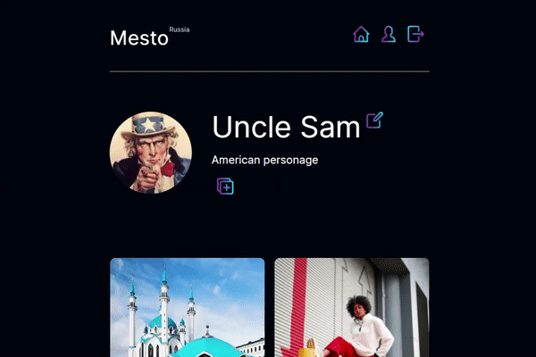

<h1 align="center">Mesto (React)</h1>
<h3 align="center">Интерактивный проект по созданию карточек</h3>
<h3 align="center"><a  href="https://stanislavponomarev93.github.io/mesto_react/">Live Demo</a></h3>
<p>


</p>

___

<h1>Описание</h1>

* <h3>Редактирование пользователя</h3>

<p align="center"></p>

Запрос на редактирование отправляется в `http://nomoreparties.co/cohort12/users/me`. Ответ сохраняется в глобальном стейте `userData`

```TypeScript
export const fethcEditUser = createAsyncThunk(
  'userData/fethcEditUser',
  function (data: UserType) {
    return mestoApi.sendUserInfo(data.name, data.about).then(res => res);
  }
);

builder.addCase(fethcEditUser.fulfilled, (state, action) => {
  state.userData = action.payload;
  state.button = true;
});
```

* <h3>Изменение аватара</h3>

<p align="center"></p>

Запрос на редактирование отправляется в `http://nomoreparties.co/cohort12/users/me/avatar`. Ответ сохраняется в глобальном стейте `userData`.

```TypeScript
export const fethcEditUserAvatar = createAsyncThunk(
  'userData/fethcEditUserAvatar',
  function (data: UserType) {
    return mestoApi.changeAvatar(data.avatar).then(res => res);
  }
);

builder.addCase(fethcEditUserAvatar.fulfilled, (state, action) => {
  state.userData = action.payload;
  state.button = true;
});
```

* <h3>Создание новой карточки</ph3>

<p align="center"></p>

POST запрос на добавление новой карточки отправляется в `http://nomoreparties.co/cohort12/cards`. Ответ добавляется в массив уже созданных карточек, которые хранятся в глобальном стейте `cards`.

```TypeScript
export const fethcAddCard = createAsyncThunk(
  'cards/fethcAddCard',
  function (element: CardType) {
    return mestoApi.addCard(element.name, element.link).then((res) => res);
  }
);

builder.addCase(fethcAddCard.fulfilled, (state, action) => {
  state.cards = [...state.cards, action.payload];
  state.button = true;
});
```

* <h3>Удаление карточки</h3>

Удаление карточки происходит через запрос DELETE `http://nomoreparties.co/cohort12/cards/cardId`. После ответа карточка удаляется из массива глобального стейта `cards`.

```TypeScript
export const fethcDeleteCard = createAsyncThunk(
  'cards/fethcDeleteCard',
  function (element: CardType) {
    return mestoApi.deleteCard(element._id).then(() => element);
  }
);

builder.addCase(fethcDeleteCard.fulfilled, (state, action) => {
  state.cards = state.cards.filter((el: { _id: string; }) => el._id !== action.payload._id)
});
```

* <h3>Like карточки</h3>

Добавление лайка и удаление отпраляется по url `http://nomoreparties.co/cohort12/cards/like/cardId`. Реализация вынесена в кастомный хук `useLike`.

```TypeScript
function useLike(element: CardType): [{ likes: number, liked: boolean }, () => void] {
  const { userData } = useAppSelector(state => state.userData);
  const [likeData, setLikeData] = useState({
    likes: element.likes.length,
    liked: element.likes.some((i) => i._id === userData._id)
  });

  const editLike = () => {
    likeData.liked && mestoApi.deleteLike(element._id).then((res) => setLikeData({
      likes: res.likes.length,
      liked: false
    }));
    !likeData.liked && mestoApi.setLike(element._id).then((res) => setLikeData({
      likes: res.likes.length,
      liked: true
    }));
  }

  return [likeData, editLike];
}
```

* <h3>Увеличение картинки</h3>

```TypeScript
// Добавляется ссылка картинки в созданный попап

```

<p align="center">


</p>

<h2>Технологии</h2>

* Проект создан через Create React App (CRA)
* Валидация форм настроена через React Hook Form
* Хранение глобального стейта реализовано через Redux Toolkit
* Jwt авторизованного пользователя хранится в localStorage
* Используются кастомные хуки

<h2>Локальный запуск проекта</h2>

```
git clone https://stanislavponomarev93.github.io/mesto_react

npm install

npm start
```

Для авторизации можно использовать пароль и логин тестовый или зарегестрироваться

```
логин: testLogin
пароль: testPassword
```